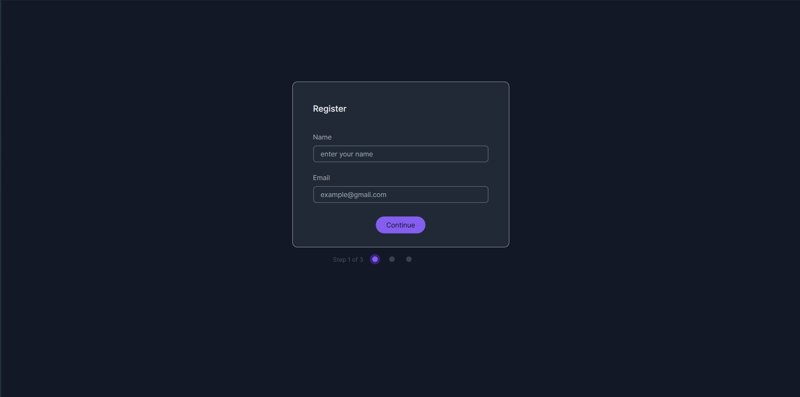
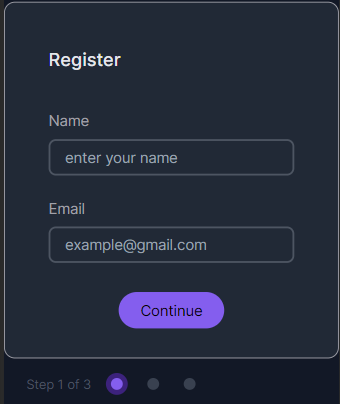

Il s'agit d'une solution pour le défi [Dev Challenges](https://devchallenges.io/challenge/35) sur Dev Challenges.

## Table des matières

- [Aperçu](#aperçu)
  - [Le défi](#le-défi)
  - [Capture d'écran](#capture-décran)
  - [Liens](#liens)
  - [Construit avec](#construit-avec)
- [Auteur](#auteur)

## Aperçu

### Le défi

- Les utilisateurs peuvent passer à l'étape suivante si les entrées sont remplies ou si le sujet est sélectionné.
- La page doit être adaptée aux différentes tailles d'écran.
- Ajouter des validations aux entrées : le nom et l'adresse électronique doivent être obligatoires et l'adresse électronique ne doit accepter que le format e-mail.

### Capture d'écran

### Liens

- [URL du site en direct](http://alexandre.bonefons.mmi-velizy.fr/Projets_HTML-CSS-JS/card_details_form/)

### Construit avec

- Vite (Framework React)
- TailwindCSS
- Javascript

## Auteur

- Dev Challenge - [@CallMeAl3x](https://devchallenges.io/profile/4b9e326e-7fac-4811-b859-ca80373be3dd)